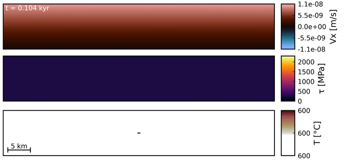

<!-- omit in toc -->
# DEDLoc
**D**eep **E**arthquake **D**uctile **Loc**alization is a collection of codes to model ductile localization by thermal runaway. The models use simple shear boundary conditions and a composite visco-elastic rheology with diffusion creep, dislocation creep, low-temperature plasticity, and a viscosity regularization.

<!-- omit in toc -->
## Content
- [1D](#1d)
- [2D](#2d)
- [How to cite](#how-to-cite)
- [Funding](#funding)

## 1D

## 2D

## How to cite
For [1D]: Spang, A., Thielmann, M., & Kiss, D. (2024). Rapid ductile strain localization due to thermal runaway. Journal of Geophysical Research: Solid Earth, 129(10), e2024JB028846. https://doi.org/10.1029/2024JB028846

For [2D]: Spang, A., Thielmann, M., de Montserrat, A., Duretz, T.. Transient propagation of ductile ruptures by thermal runaway. Journal of Geophysical Research: Solid Earth, 130, e2025JB031240. https://doi.org/10.1029/2025JB031240

[1D]: https://agupubs.onlinelibrary.wiley.com/doi/full/10.1029/2024JB028846
[2D]: https://agupubs.onlinelibrary.wiley.com/doi/10.1029/2025JB031240

## Funding
This research was funded by the DFG grant TH 2076/8-1 awarded to Marcel Thielmann. This research has been supported by the Swiss University Conference and the Swiss Council of Federal Institutes of Technology through the Platform for Advanced Scientific Computing (PASC), obtained via the PASC project GPU4GEO.